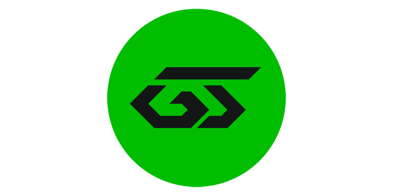

<p align="center">
  
</p>

# GameScore for Defold

[GameScore](https://gs.eponesh.com) расширение для движка [Defold](https://defold.com). GameScore это сервис для удобной
публикации HTML5 игр на разных платформах с одним SDK. Сервисом поддерживается локальная отладка игры.

- [Установка](#installation)
- [Инициализация](#initialize)
- [API](#api)
- [Вызов нативных методов платформы](#native_sdk)
- [Заглушка для других платформ, отличных от html](#mock)
- [Заглушка для нативных вызовов](#mock-native)

<a name="installation"></a>

## Установка

Вы можете использовать его в своем собственном проекте, добавив этот проект в
качестве [зависимости библиотеки Defold](https://defold.com/manuals/libraries/).

<a name="initialize"></a>

## Инициализация

В файл game.project необходимо добавить раздел gamescore и указать id и token игры, остальные параметры можно опустить:

```
[gamescore]
id = идентификатор игры
token = токен
description = There are not enough words to describe the awesomeness of the game
image = /img/ogimage.png
```

Дополнительные параметры: [(doc)](https://gs.eponesh.com/ru/docs/#socials-intro)

Для начала необходимо инициализировать SDK с помощью метода init:

```lua
local gamescore = require("gamescore.gamescore")

gamescore.init(function(success)
    if success then
        -- инициализация прошла успешно
    else
        -- ошибка инициализации
    end
end)
```

Для подписки на событие необходимо определить соответсвующий метод таблицы callbacks:

```lua
local gamescore = require("gamescore.gamescore")

local function ads_start()
    -- выключаем звук
end

local function ads_end(success)
    -- включаем звук
end

local function ads_reward()
    -- подкидываем золотишка игроку
end

-- функции событий можно назначить до инициализации SDK
gamescore.callbacks.ads_start = ads_start
gamescore.callbacks.ads_end = ads_end
gamescore.callbacks.ads_rewarded_reward = ads_reward
-- инициализация SDK
gamescore.init(function(success)
    if success then
        -- показываем прелоадер
        gamescore.ads_show_preloader(function(result)
            -- реклама закрыта, можно что-то делать
        end)
        -- что то делаем еще

        -- показываем рекламу за вознаграждение 
        gamescore.ads_show_rewarded_video()

        -- показываем рекламу за вознаграждение с использованием колбека
        gamescore.ads_show_rewarded_video(function(result)
            if result then
                -- подкидываем игроку кристаллов
            end
        end)
    else
        -- ошибка инициализации
    end
end)
```

<a name="api"></a>

## API

| GameScore JS SDK                                                                              | GameScore Lua API                                                                                                                                                                                                                                                                                                                                                                                                                             |
|-----------------------------------------------------------------------------------------------|-----------------------------------------------------------------------------------------------------------------------------------------------------------------------------------------------------------------------------------------------------------------------------------------------------------------------------------------------------------------------------------------------------------------------------------------------|
| **Инициализация** [(doc)](https://gs.eponesh.com/ru/docs/#start-init-sdk)                     |                                                                                                                                                                                                                                                                                                                                                                                                                                               |
| `window.onGSInit`                                                                             | `init(callback)`<br> Инициализация модуля<br> после инициализации будет вызвана функция callback(success) с результатом                                                                                                                                                                                                                                                                                                                       |
| **Язык** [(doc)](https://gs.eponesh.com/ru/docs/#language)                                    |                                                                                                                                                                                                                                                                                                                                                                                                                                               |
| `gs.language`                                                                                 | `language()`<br> Выбранный язык в формате ISO 639-1                                                                                                                                                                                                                                                                                                                                                                                           |
| `gs.changeLanguage(languagecode)`                                                             | `changelanguage(languagecode)`<br> Устанавливает язык в формате ISO 639-1<br> languagecode = string                                                                                                                                                                                                                                                                                                                                           |
| **Приложение** [(doc)](https://gs.eponesh.com/ru/docs/#app)                                   |                                                                                                                                                                                                                                                                                                                                                                                                                                               |
| `gs.app`                                                                                      | `app()`<br> Возвращает таблицу с информацией о приложении:<br> title: Заголовок<br> description: Описание<br> image: Изображение<br> url: URL на платформе                                                                                                                                                                                                                                                                                    |
| **Платформа** [(doc)](https://gs.eponesh.com/ru/docs/#platform)                               |                                                                                                                                                                                                                                                                                                                                                                                                                                               |
| `gs.platform`                                                                                 | `platform()`<br> Возвращает таблицу с информацией о платформе:<br> type: Тип платформы, например YANDEX, VK<br> hasIntegratedAuth: Возможность авторизации<br> isExternalLinksAllowed: Возможность размещать внешние ссылки                                                                                                                                                                                                                   |
| `gs.getNativeSDK()`                                                                           | `call_native_sdk(method, parameters, callback)`<br> Вызывает нативный метод для платформы [подобнее](#native_sdk)<br> method: метод или поле объекта нативной платформы<br> parameters: параметры вызываемого метода<br> callback: функция обратного вызова                                                                                                                                                                                   |
| **Константы платформ**                                                                        |                                                                                                                                                                                                                                                                                                                                                                                                                                               |
| ---                                                                                           | PLATFORM_CRAZY_GAMES<br> PLATFORM_GAME_DISTRIBUTION<br> PLATFORM_GAME_MONETIZE<br> PLATFORM_OK<br> PLATFORM_VK<br> PLATFORM_YANDEX                                                                                                                                                                                                                                                                                                            |
| **Разное**                                                                                    |                                                                                                                                                                                                                                                                                                                                                                                                                                               |
| `gs.isDev`                                                                                    | `is_dev()`<br> В разработке?                                                                                                                                                                                                                                                                                                                                                                                                                  |
| `gs.isMobile`                                                                                 | `is_mobile()`<br> Мобильное устройство?                                                                                                                                                                                                                                                                                                                                                                                                       |
| `gs.serverTime`                                                                               | `get_server_time()`<br> Возвращает серверное время                                                                                                                                                                                                                                                                                                                                                                                            |
| ---                                                                                           | `get_plugin_version()`<br> Возвращает версию плагина                                                                                                                                                                                                                                                                                                                                                                                          |
| **Реклама** [(doc)](https://gs.eponesh.com/ru/docs/#ads)                                      |                                                                                                                                                                                                                                                                                                                                                                                                                                               |
| `gs.ads`                                                                                      | `ads()`<br> Возвращает таблицу с информацией о менеджере рекламы:<br> isAdblockEnabled: Включен ли адблок<br> isStickyAvailable, isFullscreenAvailable, isRewardedAvailable, isPreloaderAvailable: Доступен ли баннер<br> isStickyPlaying, isFullscreenPlaying, isRewardedPlaying, isPreloaderPlaying: Играет ли сейчас реклама                                                                                                               |
| `gs.ads.showFullscreen()`                                                                     | `ads_show_fullscreen(callback)`<br> Показывает полноэкранную рекламу<br> callback(result) функция обратного вызова или nil                                                                                                                                                                                                                                                                                                                    |
| `gs.ads.showPreloader()`                                                                      | `ads_show_preloader(callback)`<br> Показывает баннерную рекламу (preloader)<br> callback(result) функция обратного вызова или nil                                                                                                                                                                                                                                                                                                             |
| `gs.ads.showRewardedVideo()`                                                                  | `ads_show_rewarded_video(callback)`<br> Показывает рекламу за вознаграждение<br> callback(result) функция обратного вызова или nil                                                                                                                                                                                                                                                                                                            |
| `gs.ads.showSticky()`                                                                         | `ads_show_sticky(callback)`<br> Показывает баннер<br> callback(result) функция обратного вызова или nil                                                                                                                                                                                                                                                                                                                                       |
| `gs.ads.refreshSticky()`                                                                      | `ads_refresh_sticky(callback)`<br> Принудительное обновление баннера<br> callback(result) функция обратного вызова или nil                                                                                                                                                                                                                                                                                                                    |
| `gs.ads.closeSticky()`                                                                        | `ads_close_sticky(callback)`<br> Закрывает баннер<br> callback() функция обратного вызова или nil                                                                                                                                                                                                                                                                                                                                             |
|                                                                                               | События:                                                                                                                                                                                                                                                                                                                                                                                                                                      |
| `gs.ads.on('start', () => {})`                                                                | `callbacks.ads_start()`<br> Показ рекламы                                                                                                                                                                                                                                                                                                                                                                                                     |
| `gs.ads.on('close', (success) => {})`                                                         | `callbacks.ads_close(success)`<br> Закрытие рекламы                                                                                                                                                                                                                                                                                                                                                                                           |
| `gs.ads.on('fullscreen:start', () => {})`                                                     | `callbacks.ads_fullscreen_start()`<br> Показ полноэкранной рекламы                                                                                                                                                                                                                                                                                                                                                                            |
| `gs.ads.on('fullscreen:close', (success) => {})`                                              | `callbacks.ads_fullscreen_close(success)`<br> Закрытие полноэкранной рекламы                                                                                                                                                                                                                                                                                                                                                                  |
| `gs.ads.on('preloader:start', () => {})`                                                      | `callbacks.ads_preloader_start()`<br> Показ preloader рекламы                                                                                                                                                                                                                                                                                                                                                                                 |
| `gs.ads.on('preloader:close', (success) => {})`                                               | `callbacks.ads_preloader_close(success)`<br> Закрытие preloader рекламы                                                                                                                                                                                                                                                                                                                                                                       |
| `gs.ads.on('rewarded:start', () => {})`                                                       | `callbacks.ads_rewarded_start()`<br> Показ рекламы за вознаграждение                                                                                                                                                                                                                                                                                                                                                                          |
| `gs.ads.on('rewarded:close', (success) => {})`                                                | `callbacks.ads_rewarded_close(success)`<br> Закрытие рекламы за вознаграждение                                                                                                                                                                                                                                                                                                                                                                |
| `gs.ads.on('rewarded:reward', () => {})`                                                      | `callbacks.ads_rewarded_reward()`<br> Получение награды за просмотр рекламы                                                                                                                                                                                                                                                                                                                                                                   |
| `gs.ads.on('sticky:start', () => {})`                                                         | `callbacks.ads_sticky_start()`<br> Показ sticky баннера                                                                                                                                                                                                                                                                                                                                                                                       |
| `gs.ads.on('sticky:render', () => {})`                                                        | `callbacks.ads_sticky_render()`<br> Рендер sticky баннера                                                                                                                                                                                                                                                                                                                                                                                     |
| `gs.ads.on('sticky:refresh', () => {})`                                                       | `callbacks.ads_sticky_refresh()`<br> Обновление sticky баннера                                                                                                                                                                                                                                                                                                                                                                                |
| `gs.ads.on('sticky:close', () => {})`                                                         | `callbacks.ads_sticky_close()`<br> Закрытие sticky баннера                                                                                                                                                                                                                                                                                                                                                                                    |
| **Игрок** [(doc)](https://gs.eponesh.com/ru/docs/#player-manager)                             |                                                                                                                                                                                                                                                                                                                                                                                                                                               |
| `gs.player`                                                                                   | `player()`<br> Возвращает таблицу с информацией об игроке:<br> isLoggedIn: Игрок авторизован<br> hasAnyCredentials: Игрок использует один из способов входа<br> id: Идентификатор игрока <br> score: Очки <br> name: Имя <br> avatar: Ссылка на аватар <br> isStub: Заглушка — пустой ли игрок или данные в нём отличаются умолчательных <br> fields: Поля игрока [(doc)](https://gs.eponesh.com/ru/docs/#player-state-fields)                |
| `gs.player.sync()`<br> `gs.player.sync({ override: true })`                                   | `player_sync(parameters, callback)`<br> Синхронизирует игрока<br> parameters = {override = boolean или nil, silent = boolean или nil} или nil<br> callback(): функция обратного вызова или nil                                                                                                                                                                                                                                                |
| `gs.player.load()`                                                                            | `player_load(callback)`<br> Принудительная загрузка игрока, с перезаписью локального<br> callback(): функция обратного вызова или nil                                                                                                                                                                                                                                                                                                         |
| `gs.player.login()`                                                                           | `player_login(callback)`<br> Вход игрока<br> callback(result): функция обратного вызова или nil                                                                                                                                                                                                                                                                                                                                               |
| `gs.player.fetchFields()`                                                                     | `player_fetch_fields(callback)`<br> Получить список полей игрока<br> callback(): функция обратного вызова или nil                                                                                                                                                                                                                                                                                                                             |
| `gs.player.get(key)`                                                                          | `player_get(key)`<br> Получить значение поля key<br> key = string                                                                                                                                                                                                                                                                                                                                                                             |
| `gs.player.set(key, value)`                                                                   | `player_set(key, value)`<br> Установить значение поля key<br> key = string<br> value = string, number или boolean                                                                                                                                                                                                                                                                                                                             |
| `gs.player.add(key, value)`                                                                   | `player_add(key, value)`<br> Добавить значение к полю key<br> key = string<br> value = string, number или boolean                                                                                                                                                                                                                                                                                                                             |
| `gs.player.toggle(key)`                                                                       | `player_toggle(key)`<br> Инвертировать состояние поля key<br> key = string<br> value = string, number или boolean                                                                                                                                                                                                                                                                                                                             |
| `gs.player.has(key)`                                                                          | `player_has(key)`<br> Проверить есть ли поле key и оно не пустое (не 0, '', false, null, undefined)<br> key = string                                                                                                                                                                                                                                                                                                                          |
| `gs.player.toJSON()`                                                                          | `player_to_json()`<br> Возвращает состояние игрока объектом (таблицей)                                                                                                                                                                                                                                                                                                                                                                        |
| `gs.player.fromJSON()`                                                                        | `player_from_json(player)`<br> Устанавливает состояние игрока из объекта (таблицы)<br> player = {key = value, key2 = value2}                                                                                                                                                                                                                                                                                                                  |
| `gs.player.reset()`                                                                           | `player_reset()`<br> Сбрасывает состояние игрока на умолчательное                                                                                                                                                                                                                                                                                                                                                                             |
| `gs.player.remove()`                                                                          | `player_remove()`<br> Удаляет игрока — сбрасывает поля и очищает ID                                                                                                                                                                                                                                                                                                                                                                           |
| `gs.player.getField(key)`                                                                     | `player_get_field(key)`<br> Получить поле по ключу key<br> key = string                                                                                                                                                                                                                                                                                                                                                                       |
| `gs.player.getFieldName(key)`                                                                 | `player_get_field_name(key)`<br> Получить переведенное имя поля по ключу key<br> key = string                                                                                                                                                                                                                                                                                                                                                 |
| `gs.player.getFieldVariantName(key, value)`                                                   | `player_get_field_variant_name(key, value)`<br> Получить переведенное имя варианта поля (enum) по ключу key и его значению value<br> key = string<br> value = string                                                                                                                                                                                                                                                                          |
|                                                                                               | События:                                                                                                                                                                                                                                                                                                                                                                                                                                      |
| `gs.player.on('sync', (success) => {})`                                                       | `callbacks.player_sync(success)`<br> Синхронизация игрока                                                                                                                                                                                                                                                                                                                                                                                     |
| `gs.player.on('load', (success) => {})`                                                       | `callbacks.player_load(success)`<br> Загрузка игрока                                                                                                                                                                                                                                                                                                                                                                                          |
| `gs.player.on('login', (success) => {})`                                                      | `callbacks.player_login(success)`<br> Вход игрока                                                                                                                                                                                                                                                                                                                                                                                             |
| `gs.player.on('fetchFields', (success) => {})`                                                | `callbacks.player_fetch_fields(success)`<br> Получение полей игрока                                                                                                                                                                                                                                                                                                                                                                           |
| `gs.player.on('change', () => {})`                                                            | `callbacks.player_change()`<br> Изменение полей игрока                                                                                                                                                                                                                                                                                                                                                                                        |
| **Таблица лидеров** [(doc)](https://gs.eponesh.com/ru/docs/#leaderboard)                      |                                                                                                                                                                                                                                                                                                                                                                                                                                               |
| `gs.leaderboard.open()`<br> `gs.leaderboard.open(parameters)`                                 | `leaderboard_open(parameters)`<br> Показать таблицу лидеров во внутриигровом оверлее, parameters таблица параметров вывода или nil                                                                                                                                                                                                                                                                                                            |
| `gs.leaderboard.fetch()`<br> `gs.leaderboard.fetch(parameters)`                               | `leaderboard_fetch(parameters, callback)`<br> Получить таблицу лидеров<br> parameters: таблица параметров вывода или nil<br> callback(leaders): функция обратного вызова                                                                                                                                                                                                                                                                      |
| `gs.leaderboard.fetchPlayerRating()`<br> `gs.leaderboard.fetchPlayerRating(parameters)`       | `leaderboard_fetch_player_rating(parameters, callback)`<br> Получить рейтинг игрока<br> parameters: таблица параметров вывода или nil<br> callback(leaders): функция обратного вызова                                                                                                                                                                                                                                                         |
| **Изолированная таблица лидеров** [(doc)](https://gs.eponesh.com/ru/docs/#scoped-leaderboard) |                                                                                                                                                                                                                                                                                                                                                                                                                                               |
| `gs.leaderboard.openScoped(parameters)`                                                       | `leaderboard_open_scoped(parameters, callback)`<br> Показать изолированную таблицу лидеров во внутриигровом оверлее, parameters таблица параметров вывода или nil<br> callback(result): функция обратного вызова                                                                                                                                                                                                                              |
| `gs.leaderboard.fetchScoped(parameters)`                                                      | `leaderboard_fetch_scoped(parameters, callback)`<br> Получить изолированную таблицу лидеров<br> parameters: таблица параметров вывода или nil<br> callback(leaders): функция обратного вызова                                                                                                                                                                                                                                                 |
| `gs.leaderboard.publishRecord(parameters)`                                                    | `leaderboard_publish_record(parameters, callback)`<br> Публикация рекорда игрока в изолированную таблицу<br> parameters: таблица с параметрами и рекордом для записи<br> callback(result): функция обратного вызова                                                                                                                                                                                                                           |
| `gs.leaderboard.fetchPlayerRatingScoped(parameters)`                                          | `leaderboard_fetch_player_rating_scoped(parameters, callback)`<br> Получить рейтинг игрока в изолированной таблице<br> parameters: таблица параметров вывода<br> callback(leaders): функция обратного вызова                                                                                                                                                                                                                                  |
| **Достижения** [(doc)](https://gs.eponesh.com/ru/docs/#achievements)                          |                                                                                                                                                                                                                                                                                                                                                                                                                                               |
| `gs.achievements.unlock(achievement)`                                                         | `achievements_unlock(achievement, callback)`<br> Разблокировать достижение<br> achievement: id или tag достижения<br> callback(result): функция обратного вызова                                                                                                                                                                                                                                                                              |
| `gs.achievements.open()`                                                                      | `achievements_open(callback)`<br> Открыть достижения в оверлее<br> callback: функция обратного вызова при открытии окна достижений                                                                                                                                                                                                                                                                                                            |
| `gs.achievements.fetch()`                                                                     | `achievements_fetch(callback)`<br> Запросить достижения<br> callback(achievements): функция обратного вызова                                                                                                                                                                                                                                                                                                                                  |
|                                                                                               | События:                                                                                                                                                                                                                                                                                                                                                                                                                                      |
| `gs.achievements.on('unlock', (achievement) => {})`                                           | `callbacks.achievements_unlock(achievement)`<br> Разблокировка достижения                                                                                                                                                                                                                                                                                                                                                                     |
| `gs.achievements.on('error:unlock', (error) => {})`                                           | `callbacks.achievements_unlock_error(error)`<br> Ошибка разблокировки достижения                                                                                                                                                                                                                                                                                                                                                              |
| `gs.achievements.on('open', () => {})`                                                        | `callbacks.achievements_open()`<br> Открытие списка достижений в оверлее                                                                                                                                                                                                                                                                                                                                                                      |
| `gs.achievements.on('close', () => {})`                                                       | `callbacks.achievements_close()`<br> Закрытие списка достижений                                                                                                                                                                                                                                                                                                                                                                               |
| `gs.achievements.on('fetch', (result) => {})`                                                 | `callbacks.achievements_fetch(result)`<br> Получение списка достижений                                                                                                                                                                                                                                                                                                                                                                        |
| `gs.achievements.on('error:fetch', (error) => {})`                                            | `callbacks.achievements_fetch_error(error)`<br> Ошибка получения списка достижений                                                                                                                                                                                                                                                                                                                                                            |
| **Платежи** [(doc)](https://gs.eponesh.com/ru/docs/#payments)                                 |                                                                                                                                                                                                                                                                                                                                                                                                                                               |
| `gs.payments.isAvailable`                                                                     | `payments_is_available()`<br> Проверка поддержки платежей на платформе                                                                                                                                                                                                                                                                                                                                                                        |
| `gs.payments.purchase(product)`                                                               | `payments_purchase(product, callback)`<br> Покупка продукта<br> product = number или string, id или tag продукта<br> callback(result): функция обратного вызова или nil                                                                                                                                                                                                                                                                       |
| `gs.payments.consume(product)`                                                                | `payments_consume(product, callback)`<br> Использование продукта<br> product = number или string, id или tag продукта<br> callback(result): функция обратного вызова или nil                                                                                                                                                                                                                                                                  |
| `gs.payments.has(product)`                                                                    | `payments_has(product)`<br> Проверка наличия покупки<br> product: id или tag продукта                                                                                                                                                                                                                                                                                                                                                         |
|                                                                                               | События:                                                                                                                                                                                                                                                                                                                                                                                                                                      |
| `gs.payments.on('purchase', (result) => {})`                                                  | `callbacks.payments_purchase(result)`<br> Покупка продукта                                                                                                                                                                                                                                                                                                                                                                                    |
| `gs.payments.on('error:purchase', (error) => {})`                                             | `callbacks.payments_purchase_error(error)`<br> Ошибка покупки продукта                                                                                                                                                                                                                                                                                                                                                                        |
| `gs.payments.on('consume', (result) => {})`                                                   | `callbacks.payments_consume(result)`<br> Использование продукта                                                                                                                                                                                                                                                                                                                                                                               |
| `gs.payments.on('error:consume', (error) => {})`                                              | `callbacks.payments_consume_error(error)`<br> Ошибка использования продукта                                                                                                                                                                                                                                                                                                                                                                   |
| `gs.payments.on('fetchProducts', (result) => {})`                                             | `callbacks.payments_fetch_products(result)`<br> Получение списка продуктов                                                                                                                                                                                                                                                                                                                                                                    |
| `gs.payments.on('error:fetchProducts', (error) => {})`                                        | `callbacks.payments_fetch_products_error(error)`<br> Ошибка получения списка продуктов                                                                                                                                                                                                                                                                                                                                                        |
| **Социальные действия** [(doc)](https://gs.eponesh.com/ru/docs/#socials)                      |                                                                                                                                                                                                                                                                                                                                                                                                                                               |
| `gs.socials`                                                                                  | `socials()`<br> Возвращает таблицу с информацией о возможных социальных действиях<br> isSupportsNativeShare: поддерживается ли нативный шаринг<br> isSupportsNativePosts: поддерживается ли нативный постинг<br> isSupportsNativeInvite: поддерживаются ли нативные инвайты<br> canJoinCommunity: можно ли приглашать в сообщество на текущей платформе<br> isSupportsNativeCommunityJoin: поддерживается ли нативное вступление в сообщество |
| `gs.socials.share(parameters)`                                                                | `socials_share(parameters)`<br> Поделиться<br> parameters: таблица с параметрами или nil                                                                                                                                                                                                                                                                                                                                                      |
| `gs.socials.post(parameters)`                                                                 | `socials_post(parameters)`<br> Опубликовать пост<br> parameters: таблица с параметрами или nil                                                                                                                                                                                                                                                                                                                                                |
| `gs.socials.invite(parameters)`                                                               | `socials_invite(parameters)`<br> Пригласить друзей<br> parameters: таблица с параметрами или nil                                                                                                                                                                                                                                                                                                                                              |
| `gs.socials.joinCommunity()`                                                                  | `socials_join_community()`<br> Вступить в сообщество                                                                                                                                                                                                                                                                                                                                                                                          |
| **Игровые переменные** [(doc)](https://gs.eponesh.com/ru/docs/#game-variables-open)           |                                                                                                                                                                                                                                                                                                                                                                                                                                               |
| `gs.variables.fetch()`                                                                        | `game_variables_fetch(callback)`<br> Запросить переменные<br> callback(): функция обратного вызова или nil                                                                                                                                                                                                                                                                                                                                    |
| `gs.variables.get(variable)`                                                                  | `game_variables_get(variable)`<br> Получить значение переменной<br> variable: название запрашиваемой переменной                                                                                                                                                                                                                                                                                                                               |
| `gs.variables.has(variable)`                                                                  | `game_variables_has(variable)`<br> Проверить существование переменной<br> variable: название переменной                                                                                                                                                                                                                                                                                                                                       |
| `gs.variables.type(variable)`                                                                 | `game_variables_get_type(variable)`<br> Получить тип переменной<br> variable: название переменной                                                                                                                                                                                                                                                                                                                                             |
| Константы типов переменной:                                                                   | VARIABLE_DATA или VARIABLE_STRING: строка<br> VARIABLE_STATS или VARIABLE_NUMBER: число<br> VARIABLE_FLAG или VARIABLE_BOOLEAN: флаг<br> VARIABLE_HTML: текст в формате html<br> VARIABLE_IMAGE: ссылка на изображение<br> VARIABLE_FILE: ссылка на файл                                                                                                                                                                                      |
|                                                                                               | События:                                                                                                                                                                                                                                                                                                                                                                                                                                      |
| `gs.variables.on('fetch', () => {})`                                                          | `callbacks.game_variables_fetch()`<br> Получение переменных                                                                                                                                                                                                                                                                                                                                                                                   |
| `gs.variables.on('error:fetch', (error) => {})`                                               | `callbacks.game_variables_fetch_error(error)`<br> Ошибка получения переменных                                                                                                                                                                                                                                                                                                                                                                 |
| **Подборки игр** [(doc)](https://gs.eponesh.com/ru/docs/#games-collections)                   |                                                                                                                                                                                                                                                                                                                                                                                                                                               |
| `gs.gamesCollections.open(collection)`                                                        | `games_collections_open(collection, callback)`<br> Открыть оверлей с играми<br> collection = number или string, id или tag коллекции или nil<br> callback(): Функция обратного вызова или nil                                                                                                                                                                                                                                                 |
| `gs.gamesCollections.fetch(collection)`                                                       | `games_collections_fetch(collection, callback)`<br> Получить коллекцию игр<br> collection = number или string, id или tag коллекции или nil<br> callback(result): Функция обратного вызова или nil                                                                                                                                                                                                                                            |
|                                                                                               | События:                                                                                                                                                                                                                                                                                                                                                                                                                                      |
| `gs.gamesCollections.on('open', () => {})`                                                    | `callbacks.games_collections_open()`<br> Открыт оверлей с играми                                                                                                                                                                                                                                                                                                                                                                              |
| `gs.gamesCollections.on('close', () => {})`                                                   | `callbacks.games_collections_close()`<br> Закрыт оверлей с играми                                                                                                                                                                                                                                                                                                                                                                             |
| `gs.gamesCollections.on('fetch', (result) => {})`                                             | `callbacks.games_collections_fetch(result)`<br> Получение коллекции игр                                                                                                                                                                                                                                                                                                                                                                       |
| `gs.gamesCollections.on('error:fetch', (error) => {})`                                        | `callbacks.games_collections_fetch_error(error)`<br> Ошибка получения коллекции игр                                                                                                                                                                                                                                                                                                                                                           |
| **Документы** [(doc)](https://gs.eponesh.com/ru/docs/#documents)                              |                                                                                                                                                                                                                                                                                                                                                                                                                                               |
| `gs.documents.open(parameters)`                                                               | `documents_open(parameters)`<br> Открыть политику конфиденциальности<br> parameters: таблица с параметрами                                                                                                                                                                                                                                                                                                                                    |
| `gs.documents.fetch(parameters)`                                                              | `documents_fetch(parameters, callback)`<br> Получить политику конфиденциальности<br> parameters: таблица с параметрами<br> callback(result): функция обратного вызова или nil                                                                                                                                                                                                                                                                 |
|                                                                                               | События:                                                                                                                                                                                                                                                                                                                                                                                                                                      |
| `gs.documents.on('open', () => {})`                                                           | `callbacks.documents_open()`<br> Открыта политика конфиденциальности                                                                                                                                                                                                                                                                                                                                                                          |
| `gs.documents.on('close', () => {})`                                                          | `callbacks.documents_close()`<br> Закрыта политика конфиденциальности                                                                                                                                                                                                                                                                                                                                                                         |
| `gs.documents.on('fetch', (document) => {})`                                                  | `callbacks.documents_fetch(document)`<br> Получение политики конфиденциальности                                                                                                                                                                                                                                                                                                                                                               |
| `gs.documents.on('error:fetch', (error) => {})`                                               | `callbacks.documents_fetch_error(error)`<br> Ошибка получения политики конфиденциальности                                                                                                                                                                                                                                                                                                                                                     |
| **Аналитика** [(doc)](https://gs.eponesh.com/ru/docs/#analytics)                              |                                                                                                                                                                                                                                                                                                                                                                                                                                               |
| `gs.analytics.hit(url)`                                                                       | `analytics_hit(url)`<br> Посещение или просмотр страницы                                                                                                                                                                                                                                                                                                                                                                                      |
| `gs.analytics.goal(event, value)`                                                             | `analytics_goal(event, value)`<br> Отправка достижения цели                                                                                                                                                                                                                                                                                                                                                                                   |
| **Полный экран** [(doc)](https://gs.eponesh.com/ru/docs/#fullscreen)                          |                                                                                                                                                                                                                                                                                                                                                                                                                                               |
| `gs.fullscreen.open()`                                                                        | `fullscreen_open()`<br> Войти в полноэкранный режим                                                                                                                                                                                                                                                                                                                                                                                           |
| `gs.fullscreen.close()`                                                                       | `fullscreen_close()`<br> Выйти из полноэкранного режима                                                                                                                                                                                                                                                                                                                                                                                       |
| `gs.fullscreen.toggle()`                                                                      | `fullscreen_toggle()`<br> Переключить полноэкранный режим                                                                                                                                                                                                                                                                                                                                                                                     |
|                                                                                               | События:                                                                                                                                                                                                                                                                                                                                                                                                                                      |
| `gs.fullscreen.on('open', () => {})`                                                          | `callbacks.fullscreen_open()`<br> Вход в полноэкранный режим                                                                                                                                                                                                                                                                                                                                                                                  |
| `gs.fullscreen.on('close', () => {})`                                                         | `callbacks.fullscreen_close()`<br> Выход из полноэкранного режима                                                                                                                                                                                                                                                                                                                                                                             |
| `gs.fullscreen.on('change', () => {})`                                                        | `callbacks.fullscreen_change()`<br> Переключение полноэкранного режима                                                                                                                                                                                                                                                                                                                                                                        |

<a name="native_sdk"></a>

## Вызов нативных методов платформы

Для вызова нативного метода, получения объекта или поля предназначена
функция `call_native_sdk(method, parameters, callback)`.

- method: строка, путь до метода, объекта или поля разделенного точками. Если указан путь до объекта или поля объекта,
  то parameters и callback будет проигнорирован.
- parameters: параметр вызываемого метода (string, number, boolean, table). Если необходимо передать несколько
  параметров, то параметры необходимо поместить в массив (таблицу). Порядок параметров определяется индексом
  массива.  **Не поддерживается передача функций в качестве параметров!**
- callback: функция обратного вызова, необходимо указывать, если нативный метод возвращает промис. Если callback == nil,
  то функция возвращает результат, иначе nil.

**Результат возвращаемый функцией формируется по правилам:**

1. Параметр method ссылается на объект или поле объекта:

- Если результат string, number или boolean то возвращается таблица с результатом {value = result}.
- Если результат object, то возвращается таблица.
- В случае если произошло исключение, то данные об ошибке возвращаются в виде таблицы {error = "error description"}.

2. Параметр method ссылается на функцию:

- Если результат string, number, boolean, то возвращается таблица с результатом {value = result}.
- Если результат object, то возвращается таблица.
- В случае если произошло исключение, или промис завершился ошибкой, то данные об ошибке возвращаются в виде таблицы
  {error = "error description"}.

callback(result): result - результат выполнения промиса, если промис завершился ошибкой, то result = {error = "error
description"}.

### Расширенные действия с промисами

Бывают ситуации, когда промис возвращает объект с функциями, которые может потребоваться выполнить позже. Для этих
ситуаций предусмотрен механизм сохранения объекта на уровне JS и дальнейшего его использования при следующих вызовах
API.

В этих случаях формат параметра `method` для функции `call_native_sdk` может примнимать вид:

- `var=path1.path2.path3`: объект path1.path2.path3 будет сохранен в переменную var
- `var:method`: вызов метода из ранее сохраненного объекта
- `var2=var:method2`: вызов метода (необходимо что-бы он был промисом) из ранее сохраненного объекта и сохранение
  результата в переменной var2

### Примеры различных вариантов вызова

| Запрос к СДК                     | Тип       | Вызов функции и результат                                                                                                                                                                                                                                             |
|----------------------------------|-----------|-----------------------------------------------------------------------------------------------------------------------------------------------------------------------------------------------------------------------------------------------------------------------|
| environment                      | object    | call_native_sdk("environment")<br> table                                                                                                                                                                                                                              |
| environment.i18n.lang            | string    | call_native_sdk("environment.i18n.lang")<br> {value = string}                                                                                                                                                                                                         |
| env                              | undefined | call_native_sdk("env")<br> {error = 'Field or function "env" not found!'}                                                                                                                                                                                             |
| player.getUniqueID()             | function  | call_native_sdk("player.getUniqueID")<br> {value = string}                                                                                                                                                                                                            |
| feedback.canReview()             | function  | call_native_sdk("feedback.canReview", nil, callback)<br> nil<br> После завершения промиса будет вызван callback.                                                                                                                                                      |
| getLeaderboards().then(lb => {}) | function  | call_native_sdk("lb=getLeaderboards", nil, callback)<br> nil<br> После завершения промиса будет вызван callback.<br> Результат будет сохранен в переменной JS.                                                                                                        |
| lb.setLeaderboardScore()         | function  | call_native_sdk("lb=setLeaderboardScore")<br> После завершения промиса будет вызван callback.<br> При вызове функции будет обращение к ранее сохраненной переменной JS, если она не найдена функция вернет {error = "The 'lb' object has not been previously saved!"} |

### Пример нативной работы с платформой Yandex:

```lua
local gamescore = require("gamescore.gamescore")

gamescore.init(function(result)
    if result then
        -- Получить переменные окружения Яндекса, эквивалент ysdk.environment
        local environment = gamescore.call_native_sdk("environment")

        -- Получить язык интерфейса Яндекс.Игр в формате ISO 639-1, эквивалент ysdk.environment.i18n.lang
        local language = gamescore.call_native_sdk("environment.i18n.lang")

        -- Получить таблицы лидеров, эквивалент ysdk.getLeaderboards()
        -- промис возвращает объект, сохраним его в переменную lb
        gamescore.call_native_sdk("lb=getLeaderboards", nil, function(leaderboards)
            pprint(leaderboards)
            -- Запись нового рекорда, эквивалент lb.setLeaderboardScore('leaderboard2021', 120);
            -- будем обращаться к переменной lb
            gamescore.call_native_sdk("lb:setLeaderboardScore", { "leaderboard2021", 120 })
            -- Получить данные таблицы лидеров, эквивалент lb.getLeaderboardEntries('leaderboard2021')
            gamescore.call_native_sdk("lb:getLeaderboardEntries", "leaderboard2021", nil, function(result)
                pprint(result)
            end)

            -- Получить данные таблицы лидеров с параметрами
            -- эквивалент lb.getLeaderboardEntries('leaderboard2021', {quantityTop: 10, includeUser: true, quantityAround: 3})
            local parameters = {
                "leaderboard2021",
                { quantityTop = 10, includeUser = true, quantityAround = 3 }
            }
            gamescore.call_native_sdk("lb:getLeaderboardEntries", parameters, function(result)
                pprint(result)
            end)
        end)
    end
end)
```

Представленный выше код эквивалентен коду JS:

```js
YaGames
    .init()
    .then(ysdk => {
        // Получить переменные окружения Яндекса
        let environment = ysdk.environment;

        // Получить язык интерфейса Яндекс.Игр в формате ISO 639-1
        let language = ysdk.environment.i18n.lang;

        // Получить таблицы лидеров
        ysdk.getLeaderboards().then(function (lb) {
            console.log(lb);
            // Запись нового рекорда
            lb.setLeaderboardScore('leaderboard2021', 120);
            // Получить данные таблицы лидеров
            lb.getLeaderboardEntries('leaderboard2021').then(function (result) {
                console.log(result);
            });

            // Получить данные таблицы лидеров с параметрами
            let parameters = {quantityTop: 10, includeUser: true, quantityAround: 3};
            lb.getLeaderboardEntries('leaderboard2021', parameters).then(function (result) {
                console.log(result);
            });
        });
    });
```

<a name="mock"></a>

## Заглушка для других платформ, отличных от html

Для платформ отличных от html предусмотрены заглушки для удобства отладки.

При использовании функций:

- player_get(key)
- player_set(key, value)
- player_add(key, value)
- player_toggle(key)
- player_has(key)
- player_to_json()
- player_from_json(player)

данные будут сохраняться/считываться с помощью sys.save()/sys.load() локально в/из файла "gamescore.dat" (можно
поменять)

```lua
local mock_api = require("gamescore.mock_api")

-- установим имя для файла локального хранилища данных
mock_api.file_storage = "my_storage.dat"

-- установка параметров "заглушек"
mock_api.player.name = "my player name"
mock_api.player.id = 625

-- или так
mock_api.player = function()
    return {
        isLoggedIn = false,
        hasAnyCredentials = false,
        id = 234,
        score = 500,
        name = "player name",
        avatar = "avatar",
        isStub = true,
        fields = mock_api.fields_data
    }
end
```

Каждая функция-заглушка GameScore API может быть представлена таблицей данных или функцией выполняющее действие и/или
возвращающая данные. Любые функции/данные можно переопределять для удобства работы/отладки.

<a name="mock-native"></a>

## Заглушка для нативных вызовов

Заглушки для нативных вызовов выделены в отдельный модуль, чтобы его подключить используйте функцию `set_native_api`

```lua
--native_api.lua
local M = {}

M["environment"] = {
    app = {
        id = "app_id"
    },
    browser = {
        lang = "ru"
    },
    i18n = {
        lang = "ru",
        tld = "ru"
    }
}

return M
```

```lua
local mock = require("gamescore.mock")
local native_api = require("native_api")
local gamescore = require("gamescore.gamescore")

-- Устанавливаем заглушку для нативных функций
mock.set_native_api(native_api)
-- Обращаемся к нативной функции
local result = gamescore.call_native_sdk("environment")
pprint(result)
```
